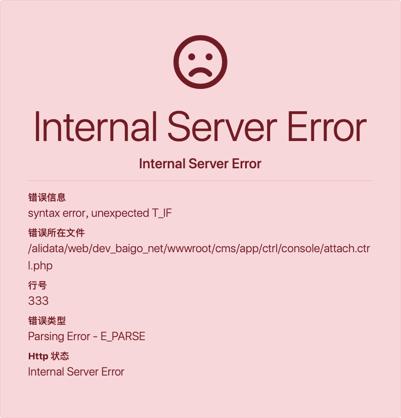
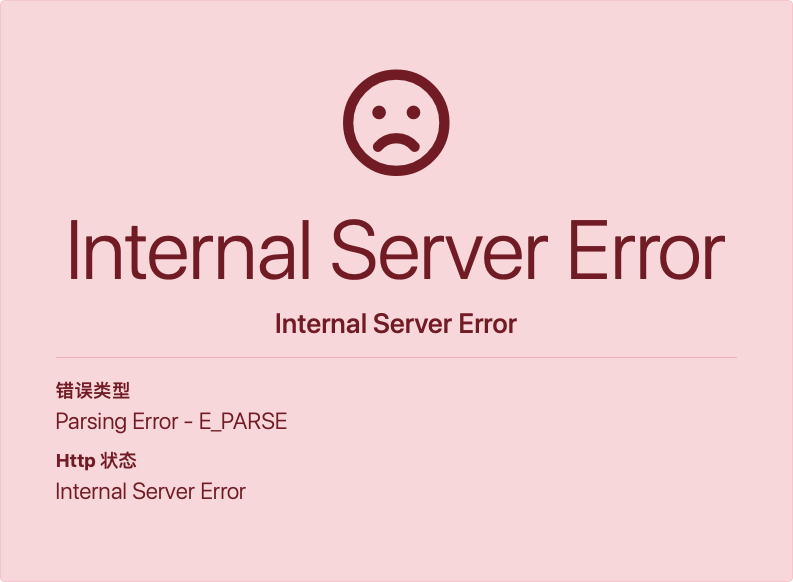

## 异常处理

和 PHP 默认的异常处理不同，ginkgo 抛出的不是单纯的错误信息，而是一个人性化的错误页面。

----------

#### 异常显示

在调试模式下，系统默认展示的异常页面：

{.img-fluid .bg-img}

只有在调试模式下面才能显示详细的错误信息，如果调试模式被关闭，看到的可能是简单的提示，例如：

{.img-fluid .bg-img}

可以通过配置参数来自定义的异常页面模板：

``` php
'tpl' => array( //模板
    ...
    'sys' => '', //系统模板
    ...
),
```
默认的异常模板为

> ginkgo/tpl/exception.tpl.php

----------

#### 异常忽略

默认框架会捕获所有的错误，包括 PHP 警告级别的错误，开发者可以在应用配置文件或者公共文件中设置要报告的错误级别，例如：

``` php
// 除了 E_NOTICE，报告其他所有错误
error_reporting(E_ALL ^ E_NOTICE);
```

> 由于错误机制的注册顺序问题，在入口文件中设置错误级别无效。

----------

#### 手动抛出和捕获异常

ginkgo 大部分情况异常都是自动抛出和捕获的，你也可以手动使用 throw 来抛出一个异常，例如：

``` php
// 使用 ginkgo 自带异常类抛出异常
throw new ginkgo\Exception('异常消息', 10006);
```

还可以通过 `setData` 方法设置一些自定义的消息

``` php
// 使用 ginkgo 自带异常类抛出异常
$exce = new ginkgo\Exception('异常消息', 10006);
$exce->setData('name', $value);
throw $exce;
```

`ginkgo\Exception` 类还提供 `getData` 方法在需要的地方调用，如：

``` php
try {
    // 这里是主体代码
} catch (ginkgo\Exception $e) {
    // 这是进行异常捕获
    return $e->getData('name');
}

try {
    // 这里是主体代码
} catch (ginkgo\Exception $e) {
    // 这是进行异常捕获
    return $e->getData(); //获取所有 data
}
```

手动捕获异常方式是使用 try-catch，例如：

``` php
try {
    // 这里是主体代码
} catch (ginkgo\Exception $e) {
    // 这是进行异常捕获
    return $e->getMessage();
}
```