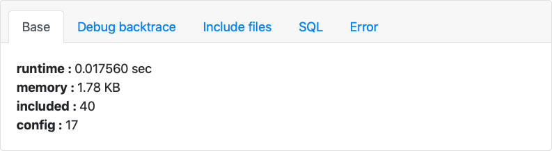

## Trace 调试

某些时候调试模式并不能完全满足需要，除了本身可以借助一些开发工具进行调试外，ginkgo 还提供了一些内置的调试工具。

Trace 调试功能就是提供给开发人员的调试辅助工具。可以实时显示当前页面或者请求的请求信息、运行情况、SQL 执行、错误信息和调试信息等。

开启 Trace 调试

``` php
'debug' => array( //调试
  'dump'  => 'trace',
  ...
),
```

Trace 调试开启后，如果有页面输出，会显示如下情况：

{.img-fluid .bg-img}

Trace 框有 6 个选项卡，分别是 Base、Debug backtrace、Include files、SQL 和 Error，点击不同的选项卡可以切换不同的 Trace 信息。

| 选项卡 | 描述 |
| - | - |
| Base | 当前页面的基本信息，如：执行时间、内存开销、文件加载数、配置文件数等等 |
| Debug backtrace | 列出当前页面执行的行为和相关流程 |
| Include files | 列出当前页面执行过程中加载的文件及其大小 |
| SQL | 当前页面执行的 SQL 语句信息 |
| Error | 当前页面执行过程中的一些错误信息，包括警告错误 |
